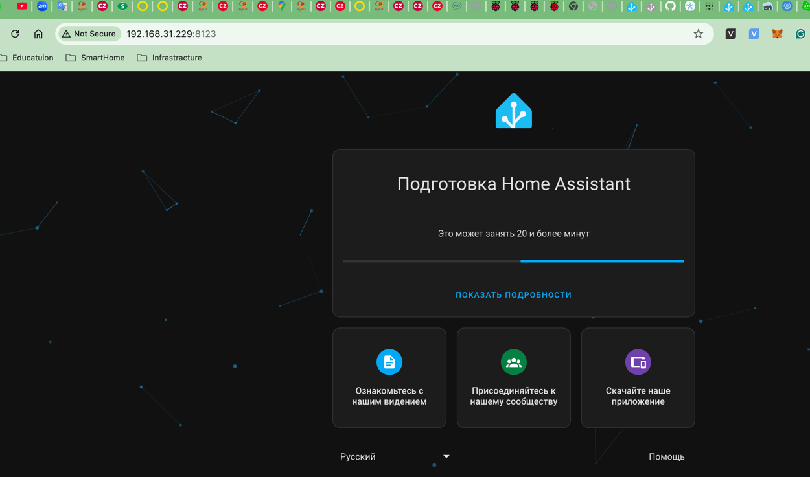

# homeassistant

# Requirements

1. Raspberry PI 4
2. Argon M2
3. SD card

# Init

1. Install on your laptop [Raspberry Pi Imager](https://www.raspberrypi.com/software/)
2. install Raspberry PI OS Lite 64 bit on sd card
3. Put SD card in raspberry
4. copy bootstrap script
    ```shell
     scp scripts/bootstrap.sh raspberrypi.local 
    ```
5. connect via ssh to it
   ```shell
       ssh raspberrypi.local 
   ```
6. Run Script
    ```shell
     sudo bootstrap.sh
   ```
7. Дополнительные настройки для устранения ошибок в НА
   ```shell
    nano /boot/firmware/cmdline.txt
   ```
   В конец первой строки файла вставляем
   `systemd.unified_cgroup_hierarchy=false lsm=apparmor`

   `Ctrl X` - для выхода    
   `Y` для сохранения
8. restart system
    ```shell
      reboot
    ```
9. copy init script
   ```shell
   scp scripts/init.sh raspberrypi.local
    ```
10. connect via ssh to it
    ```shell
        ssh raspberrypi.local 
    ```
11. Run Script
     ```shell
      sudo init.sh
     ```
12. Add user to docker group
    ```shell
     sudo gpasswd -a $USER docker
     newgrp docker
    ```
13. copy installment HA script
     ```shell
      scp scripts/install-ha.sh raspberrypi.local:
     ```
14. connect via ssh to it
    ```shell
        ssh raspberrypi.local 
    ```
15. Run Script
     ```shell
      sudo install-ha.sh
    ```
16. Choose raspberryPi4-64
17. If everything was ok then you will see: 
    ```
    [info] Within a few minutes you will be able to reach Home Assistant at:
    [info] http://homeassistant.local:8123 or using the IP address of your
    [info] machine: http://192.168.31.229:8123
    ```
18. After few minutes you can see
