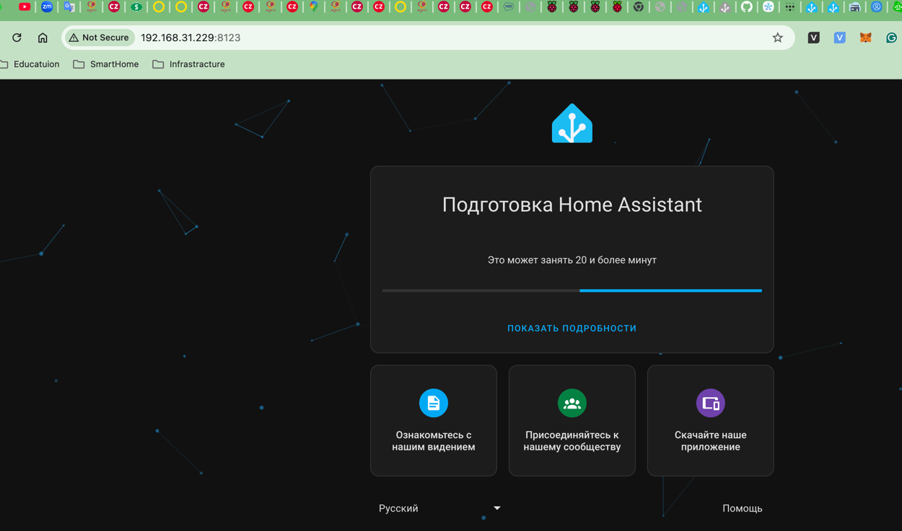

# homeassistant

# Requirements

1. Raspberry PI 4
2. Argon M2
3. SD card

# Init

1. Install on your laptop [Raspberry Pi Imager](https://www.raspberrypi.com/software/)
2. install Raspberry PI OS Lite 64 bit on sd card
3. Put SD card in raspberry
4. copy bootstrap script
    ```shell
     scp scripts/bootstrap.sh lev@raspberrypi.local:~/bootstrap.sh
    ```
5. connect via ssh to it and run the script
   ```shell
       ssh lev@raspberrypi.local -t 'sudo bash bootstrap.sh'
   ```
6. restart system
    ```shell
     ssh lev@raspberrypi.local -t  'sudo reboot'
    ```
7. copy init script
   ```shell
   scp scripts/init.sh lev@raspberrypi.local:~/init.sh
    ```
8. connect via ssh to it and run script
    ```shell
        ssh lev@raspberrypi.local -t 'sudo bash init.sh'
        ssh lev@raspberrypi.local -t 'sudo gpasswd -a $USER docker'
        ssh lev@raspberrypi.local  -t 'sudo newgrp docker'
    ```
9. copy installment HA script
     ```shell
      scp scripts/install-ha.sh lev@raspberrypi.local:
     ```
10. connect via ssh to it
    ```shell
        ssh lev@raspberrypi.local 'sudo bash install-ha.sh'
    ```
    Script will fail if you use Debian Version > 12. at this moment there is no supporting of 13th version. So install ha via docker:
    ```shell

    ssh lev@raspberrypi.local 'docker run -d \
    --name homeassistant \
    --restart=unless-stopped \
     -v /home/homeassistant/.homeassistant:/config \
    --network=host \
     ghcr.io/home-assistant/home-assistant:stable'

    ```
11. Choose raspberryPi4-64
12. If everything was ok then you will see: 
    ```
    [info] Within a few minutes you will be able to reach Home Assistant at:
    [info] http://homeassistant.local:8123 or using the IP address of your
    [info] machine: http://192.168.31.229:8123
    ```
13. After few minutes you can see


14. install tailscale
```shell
scp scripts/install-tailscale.sh lev@raspberrypi.local:
ssh lev@raspberrypi.local -t 'sudo bash install-tailscale.sh'
```